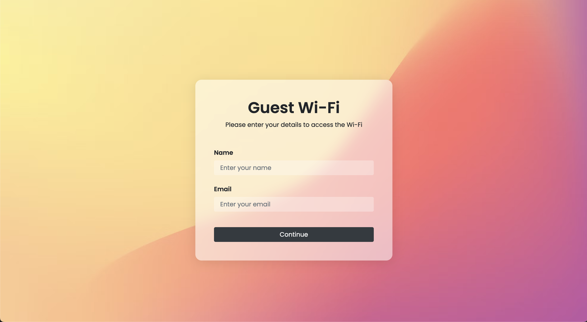

# Meraki Captive Portal with Cloudflare

*Cloudflare: WiFi Captive Portal*  
An Open-Source Meraki Captive Portal using Cloudflare Pages.

## Overview

The Meraki Captive Portal with Cloudflare is an open-source and freely accessible solution for creating customized Captive Portals tailored to Cisco Meraki wireless networks.

Utilizing Cloudflare Pages and the open-source framework of this project, you can effortlessly redirect users to your customized Splash Page, interact with them, and manage internet access as necessary.

Thanks to Cloudflare's reliable usage models, there are no associated fees, subscription costs, or ongoing maintenance requirements, making this solution equally accessible to individuals, small businesses, and organizations.

### Example and Live Demo

Test it out in real-time in your environment! Configure the following link as your WiFi Splash-Page for a non-production access point or ssid, and try it out! ```https://meraki-excap-cloudflare.pages.dev```

## Easy Setup and Installation

_Prerequisite:_ Create a Cloudflare account (www.cloudflare.com).  
_Prerequisite:_ Create a GitHub account (https://github.com/).  
1. Fork this repository to your GitHub.
2. Rename the forked repo for your desired live page URL.
3. Log in to Cloudflare and navigate to "Workers & Pages" on the sidebar.
4. Click "Create Application," then select the "Pages" tab.
5. Click "Connect to Git" and choose your forked repository.
6. Click "Begin setup" and then "Save and Deploy."
7. Wait about 5 minutes for the initial build.
8. Success! Check it out at ```https://<forked-repo-name>.pages.dev```

## Optional: Setup a custom domain name

Setting up a custom domain requires the domain to be added to Cloudflare under the "Websites" tab, as this process will add a new CNAME attribute to the domain's DNS configurations.

1. Select the "Workers & Pages" tab on the sidebar.
2. Select the pages project you want to set up a custom domain for.
3. Select the "Custom domains" tab in the main section.
4. Click the "Setup a custom domain" button.
5. Enter the domain you want to configure as the custom domain name.
6. Click the "Activate Domain" button at the bottom of the page.
7. Success! Check out your new domain in a few minutes at ```https://<custom-domain>```

## Updating Your Deployment

Updating your deployment is as easy as it comes!  
Simply commit your changes to the repository used to create the page, and Cloudflare will automatically build and deploy the next version for you! This can be altered, though, to only automatically deploy to a preview branch rather than production.

## Screenshot


### Created By
*Adam Spera & Brey Rivera*  
Find us at the links below!  
www.adamspera.dev & www.breyr.dev


## LICENSE
Apache 2.0 (see [LICENSE](./LICENSE) and [NOTICE](./NOTICE)).
